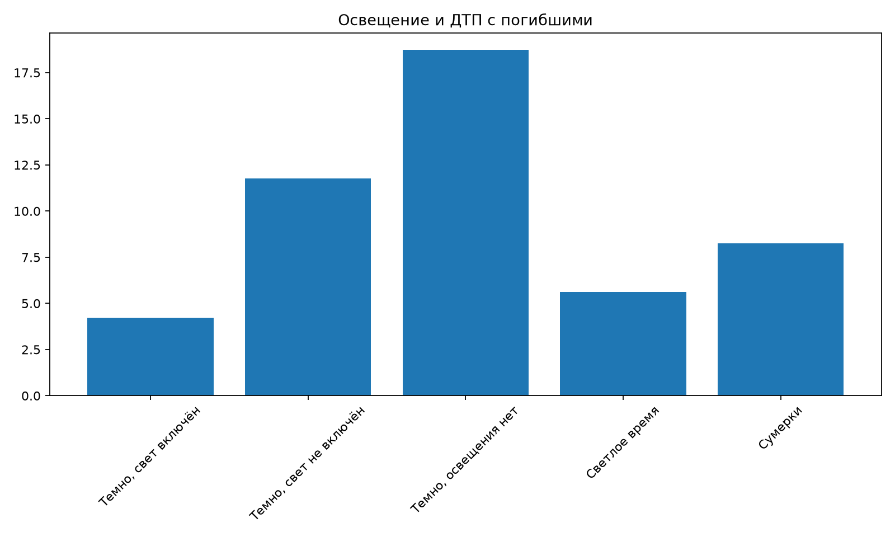
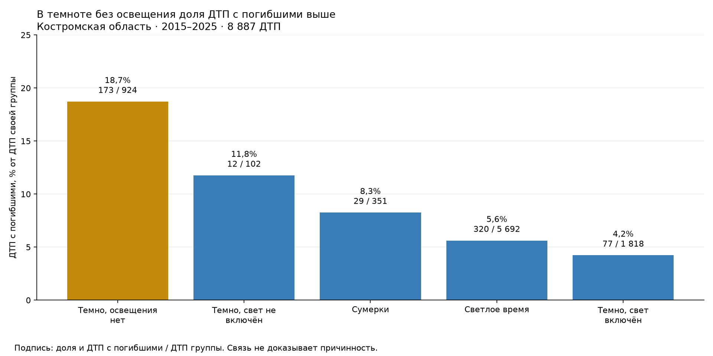

# Исследование ДТП Костромской области

Автор / GitHub: yocho8. Основной период: 2015–2025, **8 887 ДТП**.

## Данные и подготовка

Источник: [открытые данные "Карты ДТП"](https://dtp-stat.ru/opendata/), выгрузка Костромской области `kostromskaia-oblast.geojson.zip`. Файл скачал 25.09.2026 в 12:41:05 UTC. Версия данных зафиксирована SHA-256 распакованного GeoJSON: `364120bb2f289ecd804f9a3960e0db7975e16ec30f931b041612b4f0a4d7fef8`. Данные не входят в Git.

Единица анализа - одно ДТП: 8 952 записей за 01.01.2015 02:50 – 31.01.2026 11:55. Вложенные участники и транспорт не разворачиваются, поэтому ДТП не дублируются. Основные расчеты используют полные календарные годы 2015–2025. Еще 65 записей января 2026 доступны в фильтре. В каждом месяце есть записи, но это не доказывает полноту регистрации. Во всех 8 952 записях есть хотя бы один раненый или погибший: выводы нельзя переносить на аварии только с материальным ущербом.

Таблица 1. Аудит всей выгрузки.

| Проверка | Записей | Решение |
|---|---:|---|
| Пропуски в девяти основных полях, дубликаты ID, полные дубликаты, нераспознанные даты | 0 | Строки сохранены |
| Отрицательные, дробные, нечисловые счетчики; пострадавших больше участников | 0 | Проверки сохранены в коде |
| Нет адреса | 635 | Не трогаем |
| Нет родительского региона | 4 569 | Сохраняем исходную метку территории |
| Вложенные участники не совпадают с общим счетчиком | 520 | Используем общий счетчик |
| Непригодные координаты (в этой выгрузке все - нулевые) | 216 | Исключаем только из карт |
| Дополнительные подозрительные координаты | 142 | Исключаем только из карт |

Основные исходные поля: `id` – идентификатор ДТП, `datetime` – дата и местное время записи, `region` – территориальная метка, `category` – тип ДТП, `severity` – категория тяжести, `light` – условие освещения, а `participants_count`, `injured_count`, `dead_count` – числа людей. Координаты `longitude`, `latitude` заданы в градусах. Производные показатели: число пострадавших = раненые + погибшие, наличие погибших = число погибших > 0, доля ДТП с погибшими = число ДТП с погибшими / число ДТП с известным счетчиком погибших * 100%. Еще аудит описывает все 21 исходное поле, включая пустые списки и `null`. Из лекции осутствие пропусков не гарантирует содержательную корректность))

Максимум пострадавших - 42, ДТП ID 429233: 42 раненых и 44 участника.

Таблица 2. Исходная классификация тяжести по годам основного периода (число ДТП).

| Год | Легкий | Тяжелый | С погибшими |
| --- | --- | --- | --- |
| 2015 | 409 | 285 | 68 |
| 2016 | 470 | 210 | 45 |
| 2017 | 541 | 187 | 55 |
| 2018 | 493 | 205 | 53 |
| 2019 | 508 | 188 | 62 |
| 2020 | 0 | 673 | 39 |
| 2021 | 0 | 676 | 59 |
| 2022 | 0 | 656 | 49 |
| 2023 | 0 | 732 | 66 |
| 2024 | 0 | 919 | 55 |
| 2025 | 104 | 1 020 | 60 |

В 2020–2024 категория "Легкий" полностью исчезает. Причина непонятна: может быть изменения регистрации или обработки. Поэтому доли легких/тяжелых ДТП между годами не сравниваем. Основной показатель - наличие погибших по числу погибших, он совпадает с исходной категорией "С погибшими".

Подготовка сохраняет одну строку на ДТП, исходную дату и номер строки. Добавлены год, месяц, час, день недели и сезон. Неверные счетчики стали бы пропусками с флагом, но в данной выгрузке их нет.

## Исследовательские вопросы

Цепочка такая: (1) связаны ли освещение и доля ДТП с погибшими, дальше тогда вопрос, (2) после обнаружения общего контраста – сохраняется ли он внутри одного типа ДТП или объясняется составом происшествий, а (3) после максимума на графике "День недели * час" – различается ли среднее число пострадавших в выходные и будни. Так задавались мои вопросы. Все фиксированные численные результаты отчета ниже относятся к 2015–2025 годам.

Во вкладке "Динамика" максимум месячного числа записей - 06.2025: 158. Годовые числа меняются от 705 до 1 184. Рост записей нельзя приравнять к росту риска без знаний транспортного потока и проверки стабильности учета этих показателей.

Во вкладке "Исследование" шесть графиков:

1. **Типы ДТП.** Столкновения: 3 344 (37,63%). Из низ наезды на пешеходов: 2 081. Восемь ведущих типов и "Остальные" дают весь объем среза.
2. **ECDF пострадавших.** Не больше одного человека: 6 975/8 887 (78,49%). Ступенчатая кривая показывает накопленную долю, максимум не обрезал. Асимметрия объясняет, почему среднее и медиана могут различаться.
3. **День недели * час.** Максимальная ячейка: вторник, с 17:00 до 17:59, 114 ДТП. Частоты не нормированы на число дней или поток. Карта описывает время записей, не опасность часа.
4. **Будни и выходные.** Средние 1,320 и 1,410 чел./ДТП, медиана в обеих группах – 1. Числа групп и средние приведены под графиком. Связь проверяется гипотезой 3.
5. **Освещение.** Без освещения 18,72% ДТП с погибшими, со включенным – 4,24%. Подписи показывают числитель и знаменатель. Однако общее различие может быть связано с неодинаковым составом типов ДТП в двух группах. Поэтому далее, на графике в следующем пункте условия освещения сравниваются отдельно внутри каждого из пяти наиболее частых типов ДТП.
6. **Один тип – два условия освещения.** Пары столбцов сравнивают доли внутри типа и условия. Среди наездов на пешеходов разница сохраняется, а среди наездов на препятствие наоборот. Поэтому общее различие нельзя автоматически переносить на все типы. Для малых групп неопределенность выше. Статистически проверен отдельно только пешеходный контраст.

Таблица 3. Числители и знаменатели для пяти наиболее частых типов в двух ночных группах.


| Тип ДТП | Свет включен | Освещения нет |
| --- | --- | --- |
| Наезд на пешехода | 33/622; 5,31% | 71/186; 38,17% |
| Наезд на препятствие | 13/124; 10,48% | 3/34; 8,82% |
| Опрокидывание | 3/128; 2,34% | 6/52; 11,54% |
| Столкновение | 18/717; 2,51% | 49/226; 21,68% |
| Съезд с дороги | 4/59; 6,78% | 25/277; 9,03% |


## Три статистические гипотезы

Для всех трех проверок H1 двусторонняя, уровень значимости **α = 0,05**. Поскольку проверяются три гипотезы, решение принимается по p-value с поправкой Холма. Исходное p-value также приведено. Основной 95% доверительный интервал эффекта во всех трех случаях рассчитан percentile bootstrap: 5 000 повторов, ДТП независимо пересэмплируются с возвращением внутри каждой группы, `seed=42`.
### 1. Освещение и наличие погибших

H0: доли ДТП с погибшими в группах равны. H1: доли не равны. Без освещения: n = 924, 18,723%. Когда свет включен: n = 1 818, 4,235%. Все типы ДТП.

Эффект, первая группа минус вторая: **14,488 п.п.**, 95% bootstrap-ДИ [11,842; 17,243]. χ² Пирсона, статистика 155,179, p < 0,000001, p Холма < 0,000001. При α = 0,05 H0 отвергается после поправки: в зарегистрированных ДТП доля событий с погибшими различается между группами освещения.

χ² Пирсона проверяет независимость в таблице 2*2 "освещение * наличие погибших". Даже в самой малой ячейке при условии H0 ожидается 84,25 ДТП. Это больше рекомендуемого минимума 5, поэтому χ²-тест применим.

Месячная проверка устойчивости: 95% ДИ [11,622; 17,335] п.п.

### 2. Наезды на пешеходов: освещение и наличие погибших

H0: доли ДТП с погибшими в группах равны. H1: доли не равны. Без освещения: n = 186, 38,172%. Когда свет включен: n = 622, 5,305%. Выборка ограничена наездами на пешеходов.

Эффект, первая группа минус вторая: **32,867 п.п.**, 95% bootstrap и ДИ [25,666; 40,289]. χ² Пирсона, статистика 137,917, p < 0,000001, p Холма < 0,000001. При α = 0,05 H0 отвергается после поправки: различие сохраняется в выборке наездов на пешеходов.

χ² Пирсона выбран по той же причине, что две категориальные переменные образуют таблицу 2*2. Минимальная ожидаемая частота 23,94 > 5. Предполагается независимость ДТП как и в прошлом.

Месячная проверка устойчивости: 95% ДИ [25,469; 40,322] п.п.

### 3. Выходные и будни: число пострадавших

H0: средние числа пострадавших в группах равны. H1: средние не равны. Выходные: n = 2 631, 1,410 чел./ДТП, будни: n = 6 256, 1,320 чел./ДТП. Все типы ДТП.

Эффект, первая группа минус вторая: **0,089 чел./ДТП**, 95% bootstrap, а ДИ [0,049; 0,130]. t-тест Уелча, статистика 4,367, p = 0,00001283, p Холма = 0,00001283. При α = 0,05 H0 отвергается после поправки: средние различаются, но эффект около 0,09 человека на ДТП мал в абсолютных единицах.

Тест Уелча сравнивает средние без предположения равных дисперсий. Распределение асимметрично и содержит максимум 42, но обе группы велики.  bootstrap дополняет асимптотическое приближение. Можно сказать статистическая различимость сама по себе не означает практически большой эффект.

Месячная проверка устойчивости: 95% ДИ [0,047; 0,133] чел./ДТП.

**Чувствительность результатов и предпосылки bootstrap.** Дополнительно применен блочный bootstrap по календарным месяцам. Для каждого из 5 000 повторов случайно выбирались 132 месяца с возвращением (seed=43). В выборку попадали все ДТП из выбранных месяцев. Для обеих сравниваемых групп использовался одинаковый набор месяцев. Границы 95% доверительного интервала соответствуют 2,5 и 97,5 процентилям полученных эффектов. Во всех трех проверках интервалы остались выше нуля. Следовательно, направление результатов сохранилось и при таком способе пересэмплирования.

Метод учитывает возможную связь между ДТП внутри одного месяца. При этом он не учитывает связь между соседними месяцами, различия между территориями и изменения правил регистрации ДТП. Основной bootstrap пересэмплирует отдельные ДТП и сильнее зависит от предположения об их независимости. Оба варианта проверяют устойчивость результатов, но не доказывают причинную связь и не изменяют рассчитанные p-value.

Общий контраст освещения положителен в 11 из 11 лет.

## Карты и проекции

**География.** Проверен порядок longitude, latitude. Исключены нулевые/непригодные координаты и точки вне широкого прямоугольника 40–48° долготы, 57–60° широты. Оставшиеся координаты также могут содержать ошибки. Всего исключено 358, пригодно 8 529 ДТП основного периода.

Таблица 4. Неравномерность исключения координат. Наш знаменатель это все ДТП данного года. В остальных годах основного периода исключений нет.

| Год | ДТП | Исключено | Доля исключенных, % |
| --- | --- | --- | --- |
| 2015 | 762 | 102 | 13,39 |
| 2016 | 725 | 187 | 25,79 |
| 2017 | 783 | 64 | 8,17 |
| 2018 | 751 | 5 | 0,67 |

В ранние годы меньше ДТП с пригодными координатами, поэтому карты разных лет нельзя сравнивать напрямую. На точечной карте отображается не более 5 000 случайно выбранных ДТП (seed=42). Цвет точки показывает, были ли в ДТП погибшие.

Агрегированная карта учитывает все 8 529 ДТП с пригодными координатами. Территория разделена на гексогены H3 с разрешением 7. Цвет показывает количество ДТП в ячейке.

В трех наиболее заполненных ячейках около Костромы зарегистрировано 663, 662 и 409 ДТП. Вместе это 1 734 из 8 529 ДТП, или 20,3%. Результат показывает концентрацию зарегистрированных происшествий около города, но не доказывает, что движение там опаснее. Возможная причина – более высокая транспортная активность. Для ее проверки нужны сведения о транспортном потоке. В дальнейшем связь освещения с тяжестью ДТП следует сравнить отдельно для городских и загородных дорог.

**PCA.** Объект – исходная метка территории * год, минимум 20 ДТП: 94 профиля, 7 466 ДТП. Малые группы исключены ради устойчивости долей, поэтому малые территории представлены хуже. Профили имеют одинаковый вес. Восемь признаков: доли столкновений, наездов на пешеходов, съездов с дороги, отсутствующего/включенного освещения, зимних ДТП, выходных и среднее число участников. StandardScaler вычитает среднее и делит на стандартное отклонение каждого признака по профилям. Масштабирование важно из-за разных единиц и разброса.

PC1 сохраняет 32,34%, PC2 – 22,66%, вместе **55,01%** дисперсии. PC1 противопоставляет включенное освещение и пешеходные ДТП отсутствующему освещению и съездам с дороги, а PC2 связана со столкновениями и средним числом участников.

**t-SNE.** Те же объекты и стандартизованные признаки. Используем perplexity=10 и 30, seed=42, init=pca, learning_rate=auto, 1 000 итераций, евклидова метрика. Цвет – исходная доля ДТП без освещения (в процентах). Trustworthiness для десяти соседей: 0,912 и 0,901. Совпадение наборов соседей между запусками – 65,9%. Локальная структура сохраняется частично, расположение групп меняется. 

В запуске perplexity=10 нижняя ветвь (координата 2 < −20) содержит 13 профилей. Их доля ДТП без освещения 0,0–6,1%, наездов на пешеходов 21,8–45,0%. Это проверка видимого сходства по исходным признакам, группа выделена после просмотра.


## График до и после

Одна выборка и одни значения долей по освещению. После улучшения: сортировка, категории слева направо, столбцы вверх, читаемые подписи без наклона, единицы, период, числители и знаменатели, акцент на отсутствии освещения и оговорка о причинности.





## Итог

В дашборде 11 визуализаций: временной ряд, категории, ECDF, день * час, будни/выходные, освещени, освещение внутри типа, точки, гексагоны, PCA, сравнение двух t-SNE. Первые девять пересчитываются при фильтрации по периоду, территории и типу ДТП, а смена фильтра обновляет существующий график и не считается новой визуализацией. Статистические проверки и проекции заранее рассчитаны на фиксированной выборке 2015–2025 годов, это подписано во вкладке "Статистика и проекции". По умолчанию дашборд открывается на том же периоде, а 65 записей января 2026 года можно включить вручную.

**Три главных вывода.**

1. В зарегистрированных ДТП отсутствие освещения связано с большей долей событий с погибшими: разница составляет 14,488 п.п. (95% ДИ [11,842; 17,243]), а среди наездов на пешеходов – 32,867 п.п. (95% ДИ [25,666; 40,289]). Оба результата сохраняются после поправки Холма и при месячном bootstrap, но не доказывают причинный эффект освещения. Результаты: [гипотезы 1–2](#1-освещение-и-наличие-погибших), вкладка "Статистика и проекции" → "Три статистические проверки".

2. В выходные среднее число пострадавших выше на 0,089 чел./ДТП (95% ДИ [0,049; 0,130]). p Холма = 0,00001283. Эффект статистически различим, но мал в абсолютных единицах. 78,49% ДТП имеют не больше одного пострадавшего. Результаты: [гипотеза 3](#3-выходные-и-будни-число-пострадавших), вкладки "Исследование" → "Пострадавшие в будни и выходные" и "Статистика и проекции".

3. Три наиболее заполненные H3-ячейки около Костромы содержат 1 734 из 8 529 пригодных для карты ДТП (20,3%). Это концентрация зарегистрированных событий. Профили территорий и лет различаются по освещению и типам ДТП: две компоненты PCA сохраняют 55,01% дисперсии, но расположение соседей в t-SNE меняется с perplexity. Результаты: [карты и проекции](#карты-и-проекции), вкладки "Карта" и "Статистика и проекции".

**Следующий вопрос.** Сохраняется ли связь отсутствия освещения с наличием погибших после одновременного учета типа ДТП, городской/загородной дороги, разрешенной и фактической скорости, территории, сезона и года? Вопрос следует из того, что величина и даже направление различия меняются между типами ДТП, а события пространственно рядом. Для ответа нужны дорожные характеристики, а для оценки риска также надо понимать транспортный поток.

**Ограничения и недостающая информация.** Выгрузка содержит только ДТП хотя бы с одним пострадавшим и не содержит интенсивность движения, число поездок, скорость или надежность разметки. Изменение категорий тяжести в 2020–2024 годах указывает на возможную неоднородность отслеживания. Из карт исключены 358 записей, и как заметили пропуски сосредоточены в ранних годах. Анализ наблюдательный и разведочный: вопросы выбраны после просмотра тех же данных, временная и пространственная зависимость может делать интервалы слишком узкими и p-value слишком малыми. Поэтому результаты показывают только связи, обнаруженные в этой выгрузке. Они не доказывают причинно-следственные связи и не позволяют оценить вероятность ДТП во время отдельной поездки.

## Воспроизведение

Все команды выполняются из корня репозитория. На Windows PowerShell:

```powershell
py -3.12 -m venv .venv
.\.venv\Scripts\python.exe -m pip install -r solution\requirements.txt
.\.venv\Scripts\python.exe data\import_data.py "C:\path\to\kostromskaia-oblast.geojson.zip"
.\.venv\Scripts\python.exe solution\audit.py
.\.venv\Scripts\python.exe solution\generate_assets.py
.\.venv\Scripts\python.exe -m streamlit run solution\app.py
```

Основной файл зависимостей – `solution/requirements.txt` именно он используется в команде установки выше и в цели `make install`. `solution/requirements-tested.txt` содержит точные версии полного окружения, на котором выполнена итоговая проверка.

После импорта SHA-256 файла `data/raw/kostromskaia-oblast.geojson` должен быть `364120bb2f289ecd804f9a3960e0db7975e16ec30f931b041612b4f0a4d7fef8`. `solution/audit.py` повторяет аудит и сохраняет расчетные таблицы в игнорируемую Git папку `solution/outputs/`. `solution/generate_assets.py` повторно создает `solution/assets/lighting_before.png` и `solution/assets/lighting_after.png` на данных основного периода. Подготовка одной строки на ДТП находится в `solution/preparation.py`, описательные показатели – в `solution/exploration.py`, статистические проверки, bootstrap, H3, PCA и t-SNE – в `solution/advanced.py`. Наша точка входа дашборда `solution/app.py`. На macOS/Linux установка и запуск выполняются командами `make install` и `make run` после импорта данных по `docs/starter.md`. Отчет писал и работал на Windows.

Параметры случайности: `seed=42` для основного bootstrap (5 000 повторов с пересэмплированием ДТП внутри групп), подвыборки до 5 000 точек на карте и обоих запусков t-SNE, `seed=43` для месячного bootstrap (5 000 повторов, 132 месячных блока). t-SNE рассчитан на одних и тех же 94 профилях с `perplexity=10` и `30`, `init=pca`, `learning_rate=auto`, `max_iter=1000`, евклидовой метрикой. PCA с `svd_solver=full` и H3-агрегация с разрешением 7 детерминированы.

Расчеты проверены на Python 3.12.10 со следующими версиями: pandas 3.0.6, NumPy 2.5.3, Streamlit 1.64.0, Plotly 6.9.0, SciPy 1.18.1, scikit-learn 1.9.1, statsmodels 0.15.0, h3 4.5.0, Matplotlib 3.11.2, seaborn 0.13.2 и GeoPandas 1.1.4. Установленные версии можно сохранить командой `.\.venv\Scripts\python.exe -m pip freeze > environment.txt` этот файл нужен только для фиксации окружения и не является входом анализа.
